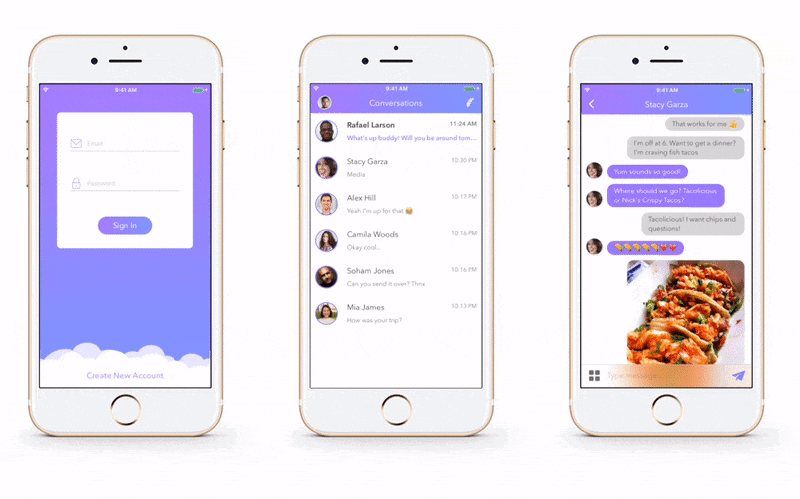

# Fasthat for iOS

FastChat for iOS is a real time chat app based on Firebase developed by Derek Lee and written in Swift 3.

FastChat allows to send and receive text messages, photos & location.

<h3 align="center">

</h3>

## Getting Started

To get started and run the app, you need to follow these simple steps:

1. Open the FastChat workspace in Xcode.
2. Change the Bundle Identifier to match your domain.
3. Go to [Firebase](https://firebase.google.com) and create new project.
4. Select "Add Firebase to your iOS app" option, type the bundle Identifier & click continue.
5. Download "GoogleService-Info.plist" file and add to the project. Make sure file name is "GoogleService-Info.plist".
6. Go to [Firebase Console](https://console.firebase.google.com), select your project, choose "Authentication" from left menu, select "SIGN-IN METHOD" and enable "Email/Password" option.
7. Open the terminal, navigate to project folder and run "pod update". 
8. You're all set! Run FastChat on your iPhone or the iOS Simulator.

## Compatibility

This project is written in Swift 3.0 and requires Xcode 8.2 to build and run.

FastChat for iOS is compatible with iOS 9.1+.

## Author

* Maximiliano Ungredda

## License

Copyright 2017 Maximiliano Ungredda

Licensed under MIT License: https://opensource.org/licenses/MIT
